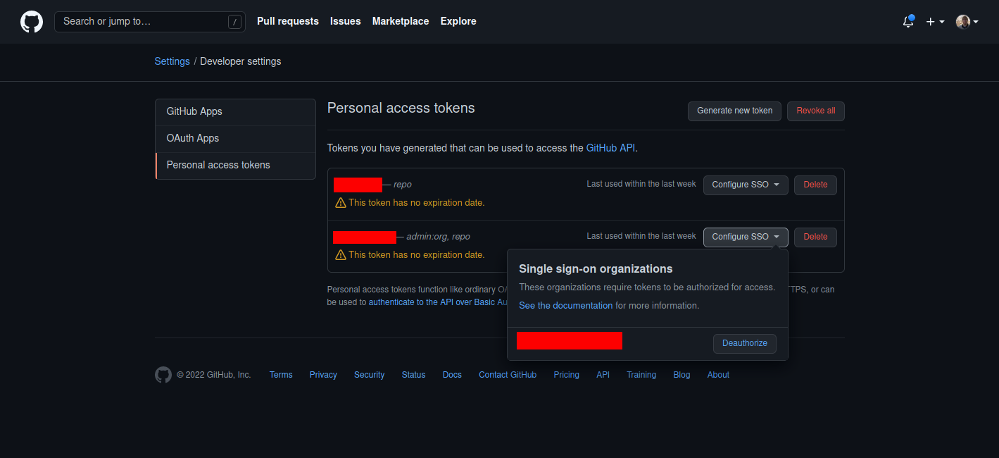
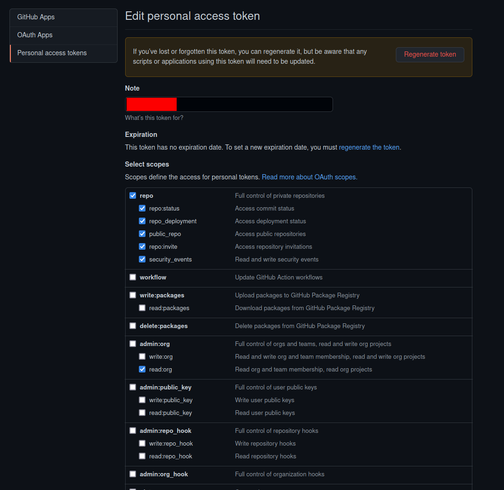

# Go-Git-Repos

# Introduction

This repository is a very simple go application that's intended to act as a backup for one's Github repos.  Given issues
in the CyberSecurity realm, it's important to have backups for data - even if it exists on the cloud.  Even for a company
as great as Github.

## Why Needed?

This comes up every so often, on why this type of thing is needed.  When it comes to personal repositories, if your account gets 
compromised, you can lose all your repositories fairly quickly.  The delete option is reversible.

With Github Enterprise, this is a tricky part.  There are backups, where you can restore a repository within 90 days, but 
there's a use case of not deleting, but destroying, a repository that this covers.  The attack vector looks like:

1. User with full privileges (read/write) to repositories is added in an org
2. User creates a new repository and points it at a current repository (`git remote add`)
3. User does a push, of that near-empty repository, with `--force` to the destination repository.

In this case, the repository isn't gone, so the undelete mentioned above wouldn't work.  Does Github have a way to 
restore in those cases?  I don't know, but having repositories backed up locally and then versioned (through Cohesity or the like),
makes sense.  A blog post, which will be linked vs the above will be written to explore this attack vector.

# Features

* Windows **and** Linux support.
* Packaged executables for easy use.
* Can be scheduled in a multitude of tools such as Cron, Windows Task Scheduler, Stonebranch, etc.
* Can work with both Github Enterprise (Organizational) based repositories, as well as personal repositories.


# Usage
## Backing up Personal Repositories

This project is fairly straightforward, and intended to be easy to use.  The main dependency is you need to have Go
installed (unless you use a package), and a JSON configuration file stored in your `$HOME/.creds/gh_vars.json`.  This
file takes the format as follows:

```json
{
	"token": "<YOUR_GH_TOKEN>",
	"backup-dir": "/path/to/backup/dir/"
}
```

### Obtaining the Token
To obtain a token:
1. Click on your profile on the upper right and select "Settings"
2. Click on "Developer Settings"
3. Click on "Personal access tokens"
4. Click on "Generate new token"

For permissions, the only thing that's needed is the `Full control of private repositories`

## Backing up Organizational Repositories

This project can also be used to backup organizational repositories.  The procedures for this is a bit different than
with personal repositories.  The JSON file needs to contain two additional elements.  If these exist, at all, then it'll switch
to an Organizational pull vs a personal pull.

**JSON**

```json
{
	"token": "<YOUR_GH_TOKEN>",
	"backup-dir": "/path/to/backup/dir",
	"types": ["Public", "Internal", "Private"],
	"org": "<YOUR_ORG>"
}
```

In the case of the "types" above, I left in all three options, but you can restrict it to a specific type, such as Public.

### Obtaining the Token.

Obtaining the token is exactly the same as in the personal option above, with the addition of authorizing it to your organization.
To do this, you simply add your user to the organization, then authorize your token to that organization.

The picture below illustrates where to find this.


In addition to this being set, you also have to setup the token for some addition privileges.  It needs at least: 
`read:org` privileges:

